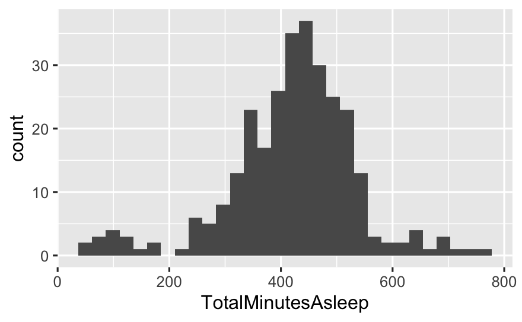
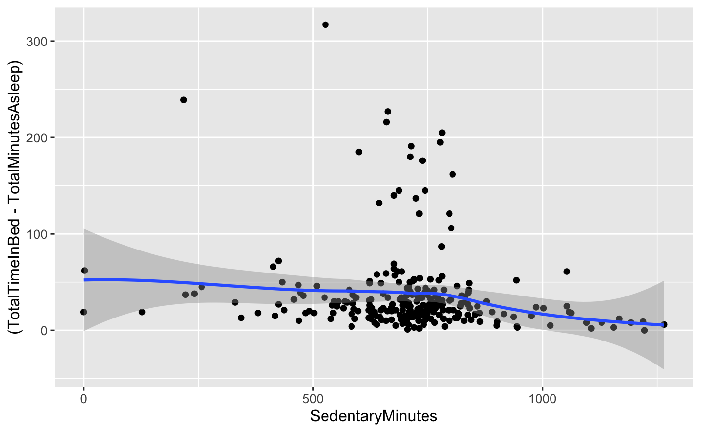
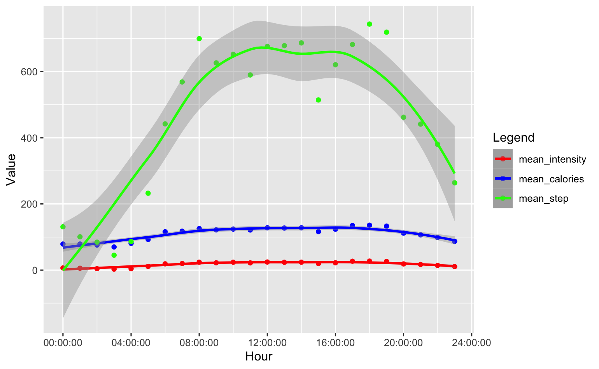
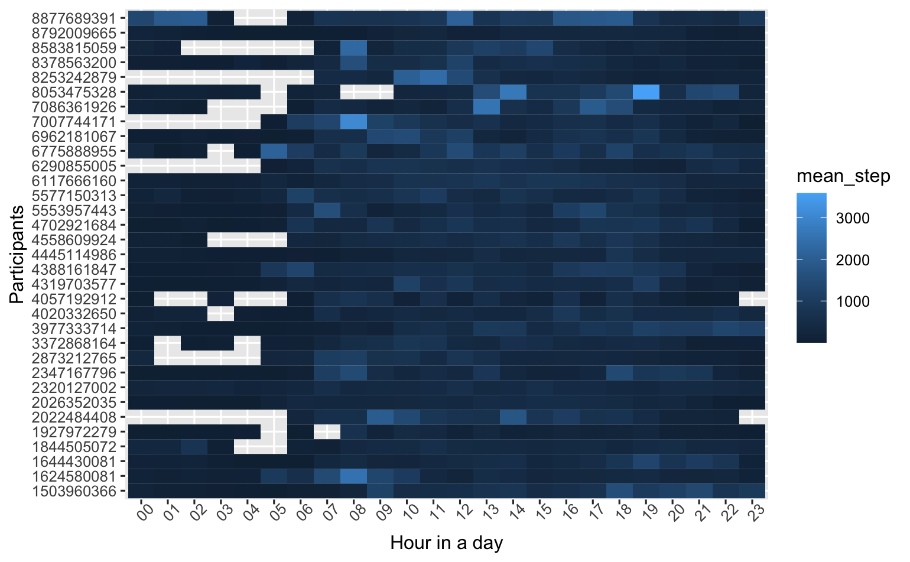

# FitBit_Fitness_Tracker_Data_Analysis

This analysis is based on the data in https://www.kaggle.com/arashnic/fitbit

# Report

## Task Summary

1. Analyze smart device data to gain insight into how consumers are using their smart devices;
2. Apply these insights with one of the Bellabeat products
3. In the presentation, present the analysis along with high-level recommendations to guide marketing strategy

### Stakeholders:

#### Executive team

​	**Urška Sršen**: Chief Creative Officer

​	**Sando Mur**: Key member of the Bellabeat executive team

#### Data science team

​	**Bellabeat marketing analytics team**: A team of data analysts responsible for collecting, analyzing, and reporting data.

## Data sources used

[FitBit Fitness Tracker Data](https://www.kaggle.com/arashnic/fitbit)

> Size: 322MB
>
> Store: Locally
>
> Format: 18 csv files with long format
>
> Bias: May contain sampling bias as all data are collected from fitbit users only
>
> 
>
> Credibility:
>
> 	- Reliable: Yes. From Amazon Mechanical Turk, accurate and complete.
> 	- Original: Yes. Collected from a survery.
> 	- Comprehensive: Yes. Including minute-level output for physical activity, heart rate, and sleep monitoring
> 	- Current: A little bit old. Data collected between 03.12.2016-05.12.2016
> 	- Cited: Yes. Generated by Amazon Mechanical Turk and updated at 2020.12.
>
> 
>
> License: CC0: Public Domain
>
> Privacy: No personally identifiable information contained.
>
> Security: Storing locally during manipulation with Dropbox backup.
>
> Openness: Open data. No Copyright. Can copy, modify, distribute and perform the work, even for commercial purposes, all without asking permission.

This dataset contains three main parts: user activity records, including intensity, sleep, steps, calories stored over minutely, hourly and daily time span.

As we want to focus on the usage habit of users, minutely data is over-detailed for us. So we will only use "Daily" and "Hourly" data below.

The data may be insufficient because of out-of-date and only coming from Fitbit users.

## Summary of the analysis

**For full and detailed analysis, please see `Fitbit_analyze_daily.Rmd` and `Fitbit_analyze_hourly.Rmd` file, or the corresponding `nb.html` files.**

### 1. What are some trends in smart device usage?
#### Fitbit_analyze_daily

In the `Fitbit_analyze_daily.Rmd` file, we focused on the sleep time analysis. We found that generally the sleep record is between 200 and 600 minutes, and most of the participants have about 450 minutes of sleep a day.

We also found that there is a ***weak linear relationship*** between `SedentaryMinutes` and the times need to fall asleep (which equal to `TotalTimeInBed-TotalMinutesAsleep`):

#### Fitbit_analyze_hourly

In the `Fitbit_analyze_hourly.Rmd` file, we analyzed the relationship among `ActivityHour`, `TotalIntensity`, `Calories` and `StepTotal`.

There are two main insights here.

First, most of the exercise happened between 8:00 to 18:00. As shown in the mean_step plot below:

Furthermore, some participants, are used to take off the smart devices during the night time. In the heatmap below, these periods are shown as blank cells:

### 2. How could these trends apply to Bellabeat customers?

For the last trend: some customers are used to take off devices during night time.

It may be caused by the user habits, out of power, or the device is not comfortable for wearing during sleep. 

Some of Bellabeat's products, like *the Bellabeat app*, *Leaf* and *Time*, can also record sleep information, which may face the same problem that customers will not use during the night.

### 3. How could these trends help influence Bellabeat marketing strategy?

We could do a questionnaire to ask our customers about their degree of satisfaction about the nighttime usage, to get more data and help cover these blank periods.

Making customers use the devices all day long without any gap can help foster customer loyalty and provide more data for the company, which in return can help give the customers back a more accurate and personalized guidance.

## Data manipulation log

Please see `Changelog.md`.

## Key findings
Some participants, are used to take off the smart devices during the night time. In the heatmap below, these periods are shown as blank cells:

Filling in these blanks may help foster customer loyalty.

## Recommendation

Do a questionnaire to ask our customers about their degree of satisfaction about the nighttime usage, to get more data and help cover these blank periods.

